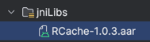

# RCache

[](https://jitpack.io/#rahmat3nanda/RCache-Android)

RCache is an Android library designed to simplify the process of storing and managing data securely. It provides a
unified API for storing data in both `SharedPreferences` and `EncryptedSharedPreferences`.

## Features

- **General SharedPreferences Storage**: Easy-to-use methods for storing and retrieving data from `SharedPreferences`.
- **Encrypted SharedPreferences Storage**: Secure storage for sensitive data using `EncryptedSharedPreferences`.
- **JitPack Support**: Easily integrate with your Android projects using JitPack.

## Installation

### JitPack

1. Add the JitPack repository to your build file.

   Add it in your root build.gradle at the end of repositories:

```groovy
    dependencyResolutionManagement {
    repositoriesMode.set(RepositoriesMode.FAIL_ON_PROJECT_REPOS)
    repositories {
        mavenCentral()
        maven { url 'https://jitpack.io' }
    }
}
```

2. Add the dependency

```groovy
    dependencies {
    // Others Dependencies
    implementation 'com.github.rahmat3nanda:RCache-Android:1.1.1'
}
```

3. Add Required dependency

```groovy
    dependencies {
   // Others Dependencies
   implementation("androidx.security:security-crypto:1.1.0-alpha06")
   implementation("com.google.code.gson:gson:2.10.1")
}
```

### Local

1. Download the latest release of [RCache](https://github.com/rahmat3nanda/RCache-Android/releases). It is recommended
   to use `.aar` files
2. Define local library in `build.gradle` (`app level`)

```groovy
android {
    // Others config

    defaultConfig {
        // Others config

        //Add this block
        sourceSets.main {
            jni.srcDirs = []
            jniLibs.srcDir "libs"
        }
    }
}

dependencies {
    implementation fileTree(include: ['*.jar'], dir: 'libs') // Add this line for .jar files
    implementation fileTree(include: ['*.aar'], dir: 'libs') // Add this line for .aar files
}
```

3. Copy the downloaded RCache binary to the `jniLibs` folder.

   
4. Add Required dependency

```groovy
    dependencies {
    // Others Dependencies
    implementation("androidx.security:security-crypto:1.1.0-alpha06")
}
```

## Usage

You can check DemoApp [here](https://github.com/rahmat3nanda/RCache-Android-Demo-App.git)

### Initialization

You can do this in your Application class or you can also do it in your Activity (Recommended in Application class)

```kotlin
import id.nesd.rcache.RCache

// initialize RCache
RCache.initialize(this)
```

#### Example implementation in Application class

MyApp.kt

```kotlin
import android.app.Application
import id.nesd.rcache.RCache

class MyApp : Application() {
    override fun onCreate() {
        super.onCreate()
        RCache.initialize(this)
    }
}
```

AndroidManifest.xml

```xml
<?xml version="1.0" encoding="utf-8"?>
<manifest xmlns:android="http://schemas.android.com/apk/res/android"
          xmlns:tools="http://schemas.android.com/tools">

    <!--Any Code-->

    <application
            android:name=".RCacheApp"
            android:allowBackup="true"
            android:dataExtractionRules="@xml/data_extraction_rules"
            android:fullBackupContent="@xml/backup_rules"
            android:icon="@mipmap/ic_launcher"
            android:label="@string/app_name"
            android:roundIcon="@mipmap/ic_launcher_round"
            android:supportsRtl="true"
            android:theme="@style/Theme.RCacheDemoAndroid"
            tools:targetApi="31">

        <!--Any Code-->

    </application>
</manifest>
```

### General Storage

#### Save Variable to General Storage

```kotlin
import id.nesd.rcache.RCache

// save ByteArray to General Storage
RCache.common.save(byteArray = emptyArray<Int>(), key = RCache.Key("byteArray"))

// save String to General Storage
RCache.common.save(string = "String", key = RCache.Key("string"))

// save Bool to General Storage
RCache.common.save(bool = true, key = RCache.Key("bool"))

// save Integer to General Storage
RCache.common.save(integer = 101, key = RCache.Key("integer"))

// save Array to General Storage
RCache.common.save(array = listOf(101, "string", true), key = RCache.Key("array"))

// save Map to General Storage
RCache.common.save(map = mapOf("bool" to true, "integer" to 101), key = RCache.Key("map"))

// save Double to General Storage
RCache.common.save(double = 2.0, key = RCache.Key("double"))

// save Float to General Storage
RCache.common.save(float = 3.01f, key = RCache.Key("float"))

// save data class to General Storage
RCache.common.save(dataClass = MyDataClass(), key = RCache.Key("dataClass"))
```

#### Read Variable from General Storage

```kotlin
import id.nesd.rcache.RCache

// read ByteArray from General Storage
RCache.common.readByteArray(key = RCache.Key("byteArray"))

// read String from General Storage
RCache.common.readString(key = RCache.Key("string"))

// read Bool from General Storage
RCache.common.readBool(key = RCache.Key("bool"))

// read Integer from General Storage
RCache.common.readInteger(key = RCache.Key("integer"))

// read Array from General Storage
RCache.common.readArray(key = RCache.Key("array"))

// read Map from General Storage
RCache.common.readMap(key = RCache.Key("map"))

// read Double from General Storage
RCache.common.readDouble(key = RCache.Key("double"))

// read Float from General Storage
RCache.common.readFloat(key = RCache.Key("float"))

// read data class from General Storage
RCache.common.readDataClass(key = RCache.Key("dataClass"), classOfT = MyDataModel::class.java)
```

#### Remove Variable from General Storage

```kotlin
import id.nesd.rcache.RCache

// remove from General Storage
RCache.common.remove(key= RCache.Key("myKey"))
```

#### Clear General Storage

```kotlin
import id.nesd.rcache.RCache

// Clear General Storage
RCache.common.clear()
```

### Credentials Storage

#### Save Variable to Credentials Storage

```kotlin
import id.nesd.rcache.RCache

// save ByteArray to Credentials Storage
RCache.credentials.save(byteArray = emptyList<Int>(), key = RCache.Key("byteArray"))

// save String to Credentials Storage
RCache.credentials.save(string = "String", key = RCache.Key("string"))

// save Bool to Credentials Storage
RCache.credentials.save(bool = true, key = RCache.Key("bool"))

// save Integer to Credentials Storage
RCache.credentials.save(integer = 101, key = RCache.Key("integer"))

// save Array to Credentials Storage
RCache.credentials.save(array = listOf(101, "string", true), key = RCache.Key("array"))

// save Map to Credentials Storage
RCache.credentials.save(map = mapOf("bool" to true, "integer" to 101), key = RCache.Key("map"))

// save Double to Credentials Storage
RCache.credentials.save(double = 2.0, key = RCache.Key("double"))

// save Float to Credentials Storage
RCache.credentials.save(float = 3.01f, key = RCache.Key("float"))

// save data class to Credentials Storage
RCache.credentials.save(dataClass = MyDataClass(), key = RCache.Key("dataClass"))
```

#### Read Variable from Credentials Storage

```kotlin
import id.nesd.rcache.RCache

// read ByteArray from Credentials Storage
RCache.credentials.readByteArray(key = RCache.Key("byteArray"))

// read String from Credentials Storage
RCache.credentials.readString(key = RCache.Key("string"))

// read Bool from Credentials Storage
RCache.credentials.readBool(key = RCache.Key("bool"))

// read Integer from Credentials Storage
RCache.credentials.readInteger(key = RCache.Key("integer"))

// read Array from Credentials Storage
RCache.credentials.readArray(key= RCache. Key ("array"))

// read Map from Credentials Storage
RCache.credentials.readMap(key= RCache. Key ("map"))

// read Double from Credentials Storage
RCache.credentials.readDouble(key= RCache. Key ("double"))

// read Float from Credentials Storage
RCache.credentials.readFloat(key= RCache. Key ("float"))

// read data class from General Storage
RCache.common.readDataClass(key = RCache.Key("dataClass"), classOfT = MyDataModel::class.java)
```

#### Remove Variable from Credentials Storage

```kotlin
import id.nesd.rcache.RCache

// remove from Credentials Storage
RCache.credentials.remove(key = RCache.Key("myKey"))
```

#### Clear Credentials Storage

```kotlin
import id.nesd.rcache.RCache

// Clear Credentials Storage
RCache.credentials.clear()
```

### Clear All Variable from General Storage & Credentials Storage

```kotlin
import id.nesd.rcache.RCache

// Clear All Variable from General Storage & Credentials Storage
RCache.clear()
```

### Define your own Key

```kotlin
import id.nesd.rcache.RCache

object MyRCacheKey {
    val myKey: RCache.Key = RCache.Key("myKey")
}
```

## License

RCache is released under the MIT License. See
the [LICENSE](https://github.com/rahmat3nanda/RCache-Android?tab=MIT-1-ov-file) file for details.

## Contact

For any questions or feedback, feel free to reach out to [rahmat3nanda@gmail.com](mailto:rahmat3nanda@gmail.com)
or [My LinkedIn](https://www.linkedin.com/in/rahmat-trinanda/).
